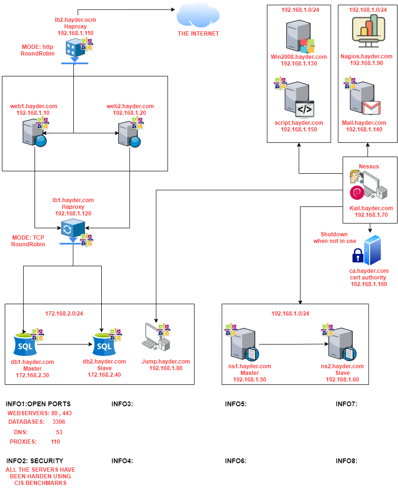

- 👋 Hi, I’m Hayder Alobaidi
- 👀 I’m interested in Information Security and Systems Engineering 
- 🌱 When I have free time I like to work on my Labs

Please feel free to explore my project repositories for more details about my labs. Here are my lab diagrams:

## PROJECT 1  Quote Of The Day Microservices App on k8s:
### Reposiotries used in this porject : 

[P2-quote_of_the_day_app-k8s](https://github.com/Hayder-alobaidi/P2-quote_of_the_day_app-k8s)

## PROJECT 1 ( EKS + Argocd with Jenkins GitOps GitHub Pipeline 
### Reposiotries used in this porject : 

[P1-GitOps-Terrform](https://github.com/Hayder-alobaidi/P1-GitOps-Terrform)

[P1-Web-app-source-code](https://github.com/Hayder-alobaidi/P1-Web-app-source-code)

[P1-kubernetes_manifest](https://github.com/Hayder-alobaidi/P1-kubernetes_manifest)

             

## PROJECT 2 ( On-Premises Complete Web and Email Hosting Company infrastructure )                                                                                  

  

